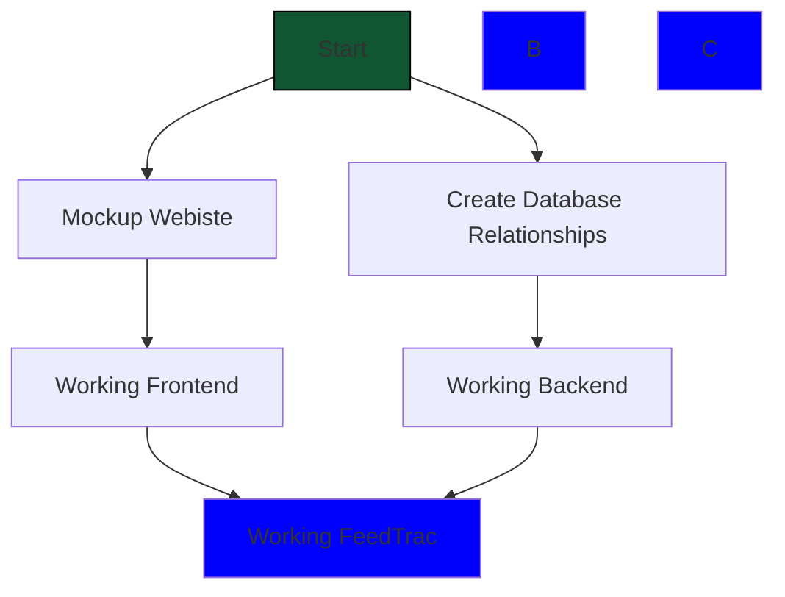

# Chart
Using mermaid to create chart. More details here: https://mermaid.js.org/intro/

Blue = Waiting,
Green = Done,
Red = Issue/Halt

```mermaid
graph TD;
    classDef toBeDone fill:#00f
    classDef completed fill:#153,stroke:#000
    classDef halted fill:#f00
    
    A:::completed
    B:::toBeDone
    C:::toBeDone
    D:::toBeDone
    
    A[Start]-->B5;
    A-->C5[Create Database Relationships];
    C5-->C10[Working Backend];
    B5[Mockup Webiste]-->B10[Working Frontend];
    B10-->D;
    C10-->D[Working FeedTrac];
    
    
```
